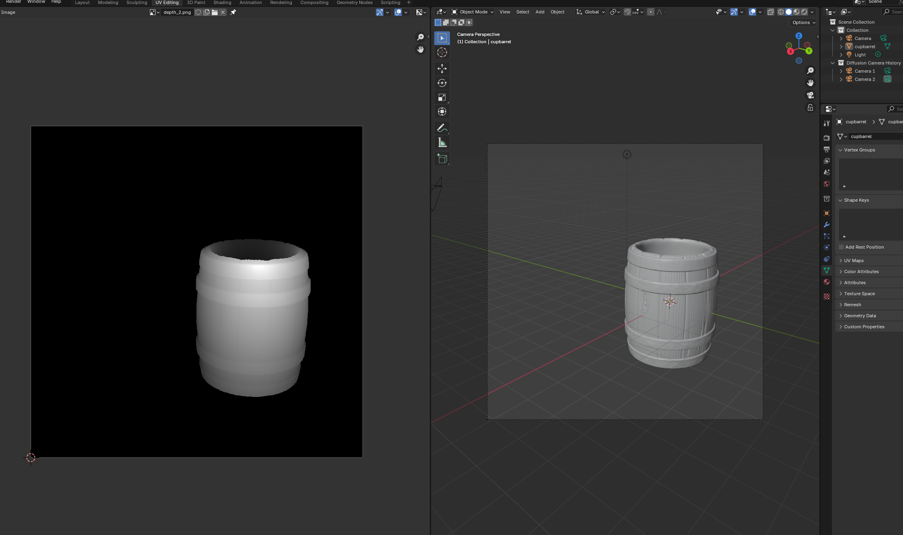
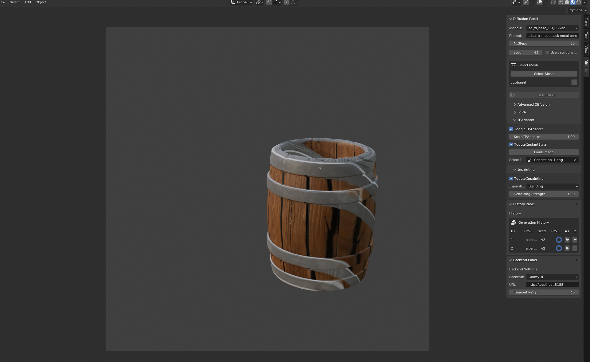
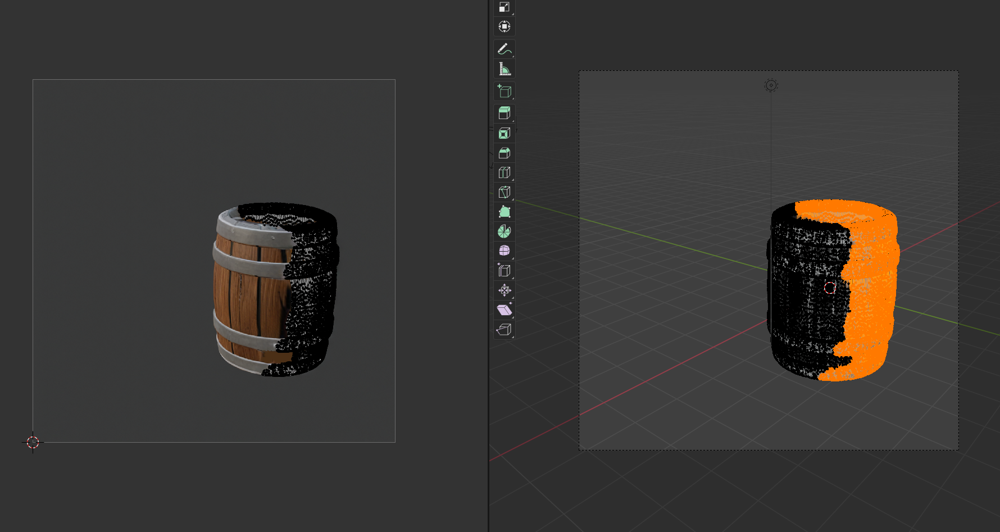
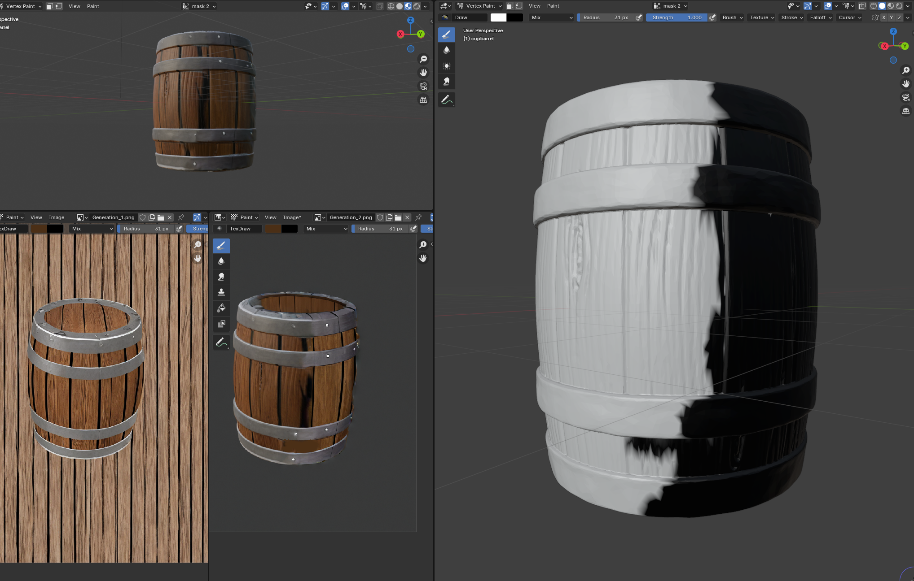
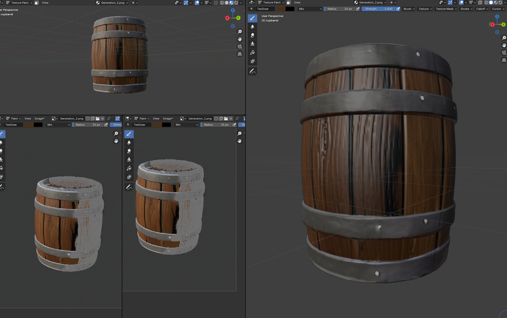
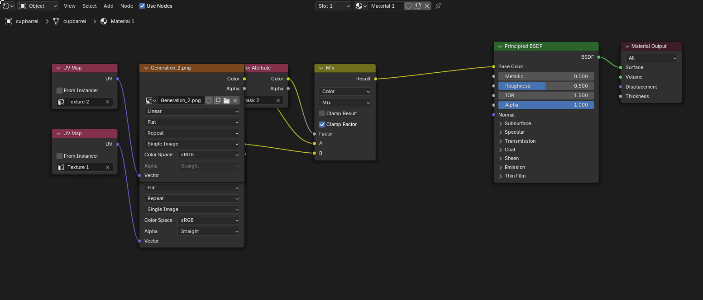

# Texture Diffusion

<div align="center" style="padding: 20px;">
    <a href="https://www.python.org/">
	    
	</a>
    <a href="https://github.com/psf/black">
        
    </a>
    <a href="https://pycqa.github.io/isort/">
        
    </a>
    <a href="https://www.blender.org/">
        
    </a>
</div>

<div align="center" style="font-style: italic">
    Generate textures for your 3D models directly within Blender using diffusion models
</div>

## Table of Contents

1. [About the Project](#about-the-project)
2. [Installation](#installation)
3. [Usage](#usage)
   - [Texture Generation](#texture-generation)
   - [Inpainting](#inpainting)
   - [Post Processing](#post-processing)
4. [Key Features & Explanations](#key-features--explanations)
   - [Model Compatibilities](#model-compatibilities)
   - [LoRAs](#loras)
   - [Depth Estimation](#depth-estimation)
   - [Image To Image rendering](#image-to-image-rendering)
   - [UV Projection](#uv-projection)
   - [Edit Masking & Textures](#edit-masking-&-textures)
   - [Multi Texture Shading](#multi-texture-shading)
5. [Roadmap](#roadmap)
6. [Credits](#credits)

---

## About the Project

**Texture Diffusion** leverages pre-trained diffusion models to bring texture generation capabilities to Blender, allowing users to integrate custom textures into their 3D models. This add-on enhances the creative workflow by giving control to the user by supporting features such as inpainting, LoRAs and IP-Adapters. This is a project I have worked on on my spare time after discovering [Stable ProjectorZ](https://stableprojectorz.com/) and I am excited to share it with the community. Feel free to provide feedback and suggestions for improvements.

_If you like the project, you can star the project on GitHub or share it with your friends. I would greatly appreciate it!_

## Installation

This add-on is using [ComfyUI](https://github.com/comfyanonymous/ComfyUI) to run diffusion models (as it's a popular installation) you need to have ComfyUI installed and running on your machine for the add-on to work properly. Follow the Installation instructions first if it's not the case.

> To Use IP-Adapter, you need to have installed [ComfyUI IPAdapter Plus](https://github.com/cubiq/ComfyUI_IPAdapter_plus) extension to your ComfyUI installation. Make sure to do so before-hand as well

### Windows

1. Downdload the `zip` file [link]()
2. Ensure you have Blender version 4.2 or above installed
3. Import the add-on into Blender via the `Edit > Preferences > Add-ons` menu

_Pillow is bundled with the add-on, so no additional installation is required._

### Linux

1. Clone the repository

```bash
git clone https://github.com/Shaamallow/texture-diffusion.git
```

2. Make sure you have Blender version 4.2 or above installed
3. Import the add-on into Blender by coping the repository in the `user addon` directory of your blender install

_If you run into issue, try to install pillow on the python environment blender has access to_

### MacOS

Should work similar to Linux, but not tested.

## Usage

To see **Texture Diffusion** in action, follow the instructions below. Video and image examples are provided for each major feature to guide you through different capabilities.

### Texture Generation

You can generate textures from the current view by entering a prompt and selecting a mesh. The texture will take some time to be created depending on the power of your ComfyUI machine (either local or remote). In this video I'm using the [Flux-dev](https://huggingface.co/black-forest-labs/FLUX.1-dev) model from [Black-Forest Labs](https://blackforestlabs.ai/).


### Inpainting

As the texture is only from a single view, the projection doesn't look great from an other point of view. You can render a new texture from a different angle using the Image-to-Image workflow. Make sure to use the different toggles. Moreover, I'm using the IP-Adapter capabilities to make sure the textures looks like the 1st generation. Try to experiment a bit with the different parameters.


### Post Processing

If you want to edit small details by hand, edit the different masks to add feathering, blending... You can do so by vertex painting and texture painting. Make sure to select the right attributes !


#### Key Features & Explanations:

To render a texture that follows a specific 3D, I'm using different Depth ControlNet to generate images that follow the geometry of the 3D model.

##### Model Compatibilities

The add-on is compatible with all SDXL and Flux type model. To make sure the right `workflow.json` is used. Make sure your model name has `FLUX` or `SDXL` in it.

##### LoRAs

The add-on allows to use for LoRAs as long as they are placed in the right ComfyUI folder. You have to make sure that the right LoRA is selected for your model type.

##### Depth Estimation

To use a control-net, the add-on will render a Depth Map from the current that you can also access in the Image data in blender. The depth map is rendered using the `Z` depth data attribute of blender but post processing is done to make sure the color distribution is normalized to look great. This can be useful if you just want to generate some depth render and use ComfyUI separately.

<div align="center">
  
</div>

##### Image To Image rendering

For Image-to-image workflow, you need to have a starting image. This will be rendered using the given viewpoint with the `opengl` render of blender. It will remove the blender UI and render the image. Make sure you are in the correct composing mode.

<div align="center">
  
</div>

##### UV Projection

The UV Mesh will be projected onto the texture instead of the texture projected on the UV-map like in the popular [Dream-texture](https://github.com/carson-katri/dream-textures) add-on. If you want to do the opposite and have a nice solution, feel free to submit a PR. Following [IanHubert's method](https://www.youtube.com/watch?v=v_ikG-u_6r0).

<div align="center">
  
</div>

##### Edit Masking & Textures

The selected vertex in `Edit Mode` will have a new `Vertex Attribute` set to 0 to use a different Texture. You check how it's done in the next section and also edit the mask to blend the edges or edit the texture for small details.

<div align="center">
  
  
</div>

##### Multi Texture Shading

I'm applying the idea from this [video](https://www.youtube.com/watch?v=dz0EjSQTuCU) but automatically.

<div align="center">
  
  <p>Shading Nodes (Multi-Texturing)</p>
</div>

## Roadmap

The following features are planned for future development:

- [ ] **Flux IP-Adapter** – Improved integration with IP-Adapter for enhanced image blending. (see [Issue](#7))
- [ ] **Multi-Object Projection**
  - [ ] Extend single-object replacement to multi-object selection.
  - [ ] Toggle option for rendering entire scenes.
- [ ] Multi Projection Generation (Search grid trick for flux generation, it's very powerful)
  - [ ] Rework the current Camera workflow
  - [ ] Allow for multiple view to be rendered at once to generate a grid for a given object (like sprites)
- [ ] **Texture Baking** – Implement baking to optimize UV projections.
- [ ] **ComfyUI API Integration** – Create a standalone API to eliminate the need for Comfy installation (planned as a premium feature).

## Credits

- [Blender](https://www.blender.org/) – Core software for 3D modeling and rendering.
- [BlenderAPI](https://docs.blender.org/api/current/index.html) – Documentation for Blender scripting.
- [ComfyUI](https://github.com/comfyanonymous/ComfyUI) – Diffusion model integration.
- [ComfyUI IPAdapter Plus](https://github.com/cubiq/ComfyUI_IPAdapter_plus) – IPAdapter functionalities.
